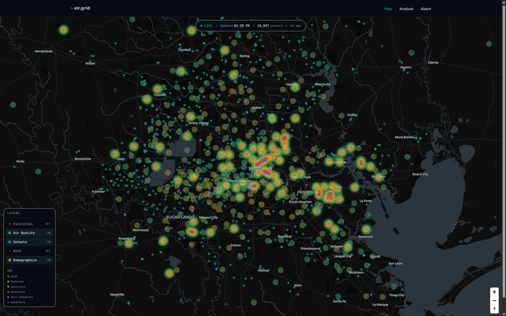

# `> air.grid`

**A live atlas of what's in the air across the U.S. — industrial emitters, real-time air-quality sensors, and the schools and neighborhoods next to them, on one interactive map.**

🔗 Live: `https://air.andrewcastor.dev` · Built on the CastorUI design system

 <!-- add after first deploy -->

---

## What it is

air.grid maps three things most people can't easily see together:

- **Industrial emitters** — facilities reporting to the EPA, sized by emissions, colored by pollutant.
- **Live air quality** — sensor readings (AirNow + PurpleAir + OpenAQ) on an hourly-updating heatmap.
- **Who's nearby** — schools, campuses, and demographics layered on top, so the data is about *places people actually are*.

An `Analysis` view ranks regions, surfaces the most-exposed campuses, and breaks down pollutants live.

## Why I built it

> ⚠️ Draft origin story — make this *true* before you publish it; you'll be asked about it in interviews.

[I kept running into the same wall: air-quality and emissions data exist, but they're scattered across
half a dozen federal portals, each with its own format, login, and rate limit. As a student in
[Texas / your field], I wanted to answer a simple question — *what's in the air around my campus?* —
and found there was no single place to just look.] So I built one.

## Features

- Dark interactive map rendering 10k+ points at 60fps (deck.gl over MapLibre).
- Independent toggle layers: facilities, air quality, schools, demographics, wind drift.
- Genuinely live: an hourly scheduled job refreshes the sensor feed; every figure shows its timestamp and source.
- Light/dark theme, mobile-degraded rendering, full data provenance on hover.

## Data sources

All public. Each carries a `source` field in-app for provenance.

| Layer | Source |
|---|---|
| Emissions / facilities | EPA ECHO, FRS, TRI, GHGRP |
| Live air quality | AirNow (EPA), PurpleAir, OpenAQ |
| Schools / colleges | NCES, IPEDS |
| Demographics | U.S. Census ACS |
| Wind | NWS (api.weather.gov) |

> Several require a free API key and impose rate limits — see `.env.example`.

## How it's built

Next.js + Tailwind + TypeScript on Vercel; Python (geopandas/shapely) for the ETL and geospatial joins.

It was built with a **multi-agent Claude Code workflow** — independent ingestion pipelines and UI
surfaces were developed by parallel subagents coordinating through a frozen data contract and a
shared status file, with sequential gates for the schema, the joins, and QA. The full agent roster,
dependency graph, and build log are in [`docs/ORCHESTRATION.md`](docs/ORCHESTRATION.md). Architecture
is in [`ARCHITECTURE.md`](ARCHITECTURE.md).

## Run locally

```bash
cp .env.example .env.local      # add your API keys
npm install
python -m pip install -r etl/requirements.txt
npm run ingest                  # build /data/*.geojson
npm run dev                     # http://localhost:3000
```

## Roadmap

- [ ] Historical playback (AQI over the last 30 days)
- [ ] Per-campus shareable report cards
- [ ] Alerting when a sensor near a saved location spikes

## Credits

Design system: CastorUI. Data: EPA, NCES, U.S. Census, NWS, PurpleAir, OpenAQ.
Built by Andrew Castor. MIT licensed.
