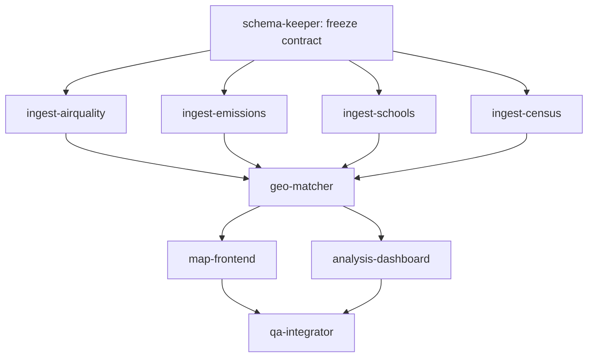

# Orchestration & Build Log

This is the artifact recruiters can actually read to see how air.grid was built with a
multi-agent Claude Code workflow. The deployed site shows the *result*; this shows the
*method*. Keep it updated as you build — the decision trail is the point.

---

## Agent roster

| Agent | Phase | Runs with | Owns | Model |
|---|---|---|---|---|
| schema-keeper | 0 / ongoing | — | `/data/schema.contract.json` | sonnet |
| ingest-airquality | 1 | parallel | `/data/sensors.geojson` + live cron | sonnet |
| ingest-emissions | 1 | parallel | `/data/facilities.geojson` | sonnet |
| ingest-schools | 1 | parallel | `/data/schools.geojson` | sonnet |
| ingest-census | 1 | parallel | `/data/demographics.geojson` | sonnet |
| geo-matcher | 2 | sequential | `/data/joins/*` | sonnet |
| map-frontend | 3 | parallel | `/app` (map routes) | sonnet |
| analysis-dashboard | 3 | parallel | `/app` (analysis routes) | sonnet |
| qa-integrator | 4 | sequential | `/docs/QA_REPORT.md` | sonnet |

Orchestration / synthesis runs on Opus (the main session). `ingest-emissions`,
`ingest-schools`, and `ingest-census` are clones of `ingest-source.template.md`.

## Dependency graph



The two fan-outs (Phase 1 ingestion, Phase 3 UI) are where parallel agents earn their keep.
Everything between them is a sequential dependency and must not be parallelized.

## How to run it

1. Scaffold + freeze the contract (main session, sequential):
   ```
   Use the schema-keeper subagent to author /data/schema.contract.json from ARCHITECTURE.md §4, then freeze it.
   ```
2. Fan out Phase 1 — ask the orchestrator to dispatch ingestion concurrently:
   ```
   Run ingest-airquality, ingest-emissions, ingest-schools, and ingest-census in parallel. Each writes only its own /data table and updates /STATUS.md.
   ```
   (The main session spawns them; each runs in its own isolated context and returns a summary.)
3. After all four report DONE in `/STATUS.md`:
   ```
   Use the geo-matcher subagent to build /data/joins from the ingested tables.
   ```
4. Fan out Phase 3:
   ```
   Run map-frontend and analysis-dashboard in parallel.
   ```
5. Gate:
   ```
   Use the qa-integrator subagent to validate end to end and write /docs/QA_REPORT.md.
   ```

## Why multi-agent here (the honest version)

Agents are used where subtasks are genuinely independent — separate data sources, separate
UI surfaces — so they can run concurrently without colliding. They are NOT used for the
sequential glue (contract, joins, QA), because forcing parallelism there would just create
race conditions. The skill being demonstrated is *knowing which is which*, plus designing the
file-based coordination (`schema.contract.json` + `STATUS.md`) that lets isolated-context
agents work together. That judgment is the thing worth showing a recruiter — more than raw
agent count.

## geo-matcher parameters (Phase 2)

### school_exposure join (`/etl/geo_matcher.py`)

| Parameter | Value | Description |
|---|---|---|
| `FACILITY_RADIUS_M` | 10,000 m (10 km) | Maximum distance from a school to count a facility as "nearby" |
| `FACILITY_TOP_N` | 5 | Maximum number of nearby facilities returned per school |
| `SENSOR_RADIUS_M` | 50,000 m (50 km) | Maximum distance to a sensor for AQI assignment |
| `EARTH_RADIUS_M` | 6,371,000 m | Mean Earth radius used for radian-to-metre conversion |
| Distance method | Scaled-Euclidean radian approximation | Coordinates converted to radians; longitude scaled by cos(mean_lat). Accurate to ~0.1% for continental US distances. scipy.spatial.cKDTree used for all nearest-neighbour lookups. |
| Downwind tolerance | ±45° | School is flagged `is_downwind=true` if any nearby facility's bearing (facility → school) falls within 45° of the meteorological downwind direction. |

### facility_demographics join (`/etl/geo_matcher_facility_demo.py`)

| Parameter | Value | Description |
|---|---|---|
| `NEAREST_K` | 1 | Each facility is matched to exactly 1 nearest Census tract centroid; no radius filter applied |
| Distance method | Scaled-Euclidean radian approximation | Same approach as school_exposure: coords to radians, lng scaled by cos(mean_lat), scipy.spatial.cKDTree batch query with `workers=-1`. |
| Join type | Nearest-centroid (unconditional) | Every facility receives a demographic match; no facility is left unmatched. |
| `SOURCE_TAG` | `geo-matcher-2026-06-01` | Provenance string written to the `source` field on every output feature. |

## Build log (fill in as you go)

| Date | Phase | Agent(s) | What happened | Decisions / surprises |
|---|---|---|---|---|
| 2026-06-01 | 0 | schema-keeper | Authored and froze schema.contract.json v1.0.0 | All 7 tables defined; lat/lng duplicated in properties for deck.gl |
| 2026-06-01 | 1 | ingest-airquality, ingest-emissions, ingest-schools, ingest-census | Parallel ingestion of all four data sources | 268,980 facilities, 108,336 schools, 15,897 sensors, 84,539 tracts, 76 wind points |
| 2026-06-01 | 2 | geo-matcher | Built school_exposure.geojson (108,336) and facility_demographics.geojson (268,980) | Scaled-radian cKDTree; entire pipeline in 44s; 0 schema errors on both outputs |
| | 3 | map-frontend, analysis-dashboard | | |
| | 4 | qa-integrator | | |

## Contract changes

### 2026-06-01 — Initial contract authored and frozen (schema-keeper)

Version 1.0.0. Contract authored from scratch against ARCHITECTURE.md §4 before any
ingestion has started. No prior contract existed.

Tables defined:

| Table | File | Geometry | Fields | Notes |
|---|---|---|---|---|
| facilities | /data/facilities.geojson | Point | id, name, lat, lng, type, operator, pollutants[], emissions_value, emissions_unit, year, source | operator is optional; pollutants is a non-empty array |
| sensors | /data/sensors.geojson | Point | id, lat, lng, aqi, pm25, o3, observed_at, source | aqi/pm25/o3 are optional (null if unmeasured); hourly refresh |
| schools | /data/schools.geojson | Point | id, name, lat, lng, level, enrollment, source | level is enum k12\|college; enrollment optional |
| demographics | /data/demographics.geojson | Point | geoid, lat, lng, population, median_income, pct_minority, source | centroid points; median_income optional (Census suppression) |
| wind | /data/wind.geojson | Point | cell_id, lat, lng, speed_mps, dir_deg, observed_at, source | meteorological degrees; hourly refresh |
| joins/school_exposure | /data/joins/school_exposure.geojson | Point | school_id, school_name, lat, lng, nearest_facility_ids[], nearest_facility_distances_m[], max_emissions_nearby, nearest_aqi, nearest_sensor_id, nearest_sensor_distance_m, is_downwind, source | derived by geo-matcher Phase 2 |
| joins/facility_demographics | /data/joins/facility_demographics.geojson | Point | facility_id, facility_name, lat, lng, geoid, population, median_income, pct_minority, source | derived by geo-matcher Phase 2 |

Design decisions:
- Kept contract minimal: only fields the UI, analysis dashboard, and geo-matcher actually
  consume. Resisted adding state/city/address fields (not needed by any current consumer).
- lat/lng duplicated in properties alongside GeoJSON geometry for deck.gl layer convenience.
- pct_minority stored as fraction (0.0–1.0), not percentage, to avoid ambiguity.
- emissions_value carries only the primary pollutant magnitude; full per-pollutant breakdown
  is out of scope for v1 (the pollutants[] array records which pollutants are reported).
- join tables are separate files, never mutations of the source tables, so parallel ingestion
  agents cannot corrupt each other.

Freeze note: Phase 1 may now begin. All subsequent field additions require an explicit
request in /STATUS.md under "Schema change requests" before schema-keeper will merge them.
